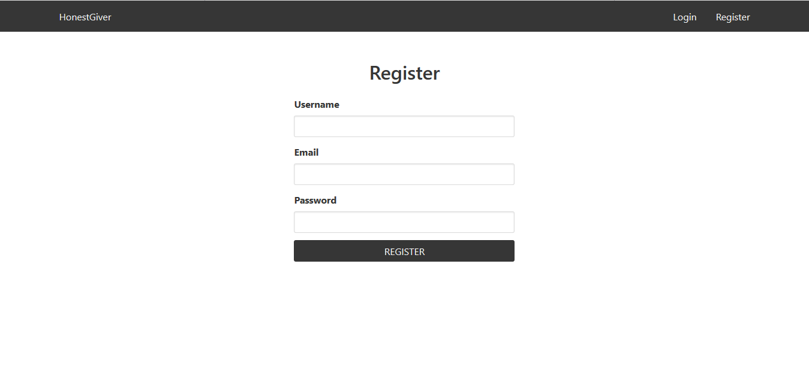
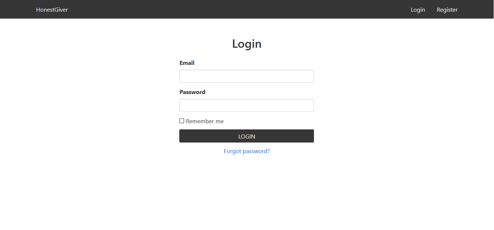
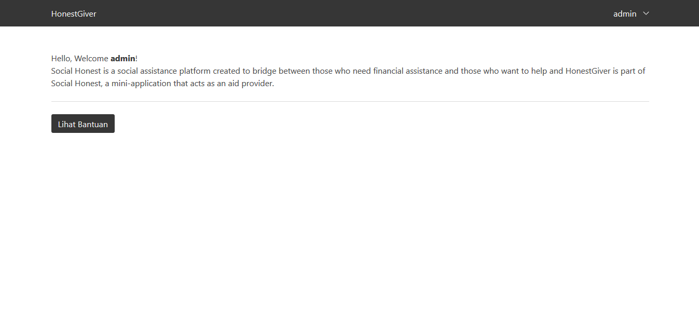

# HonestGiver

Social Honest is a social assistance platform created to bridge between those who need financial assistance and those who want to help and HonestGiver is part of Social Honest, a mini-application that acts as an aid provider.
in this application, i use several featured as :

1. Bodyparser
2. Session
3. Authentication
4. Web security middleware
5. CORS
6. Edge template engine
7. Lucid ORM
8. Migrations and seeds

## Getting Started
To getting started you clone the repo

```bash
https://github.com/ivandi1980/HonestGiver.git
```

## Usage
in order to run this application the 1st step you have to Install dependencies directly by using

```bash
npm install
```

## Database setup 
you can copy or import the honestgiver.sql using phpmyadmin or sqlyog or another tools.

## Run Server (nodemon suggested)
before you run this apps, please make sure you already have nodemon installed on your machine.
but if you don't have nodemon installed on your machine, please install it

```bash
npm install -g nodemon
```

and after that, to run this application just run :

```bash
nodemon server.js
```

## Important, before & after login
1. if you can not login, you can open your database, find user table and change is_active from 0 to 1
2. if you import honestgiver.sql to the database, use email : admin@admin.com, password admin to login

## ScreenShoot




